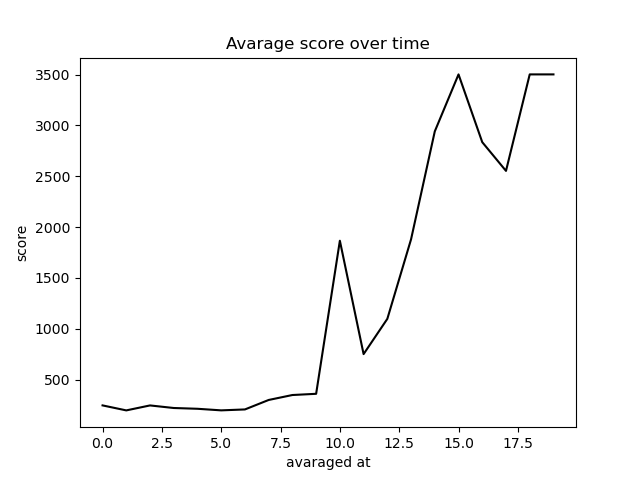

# Self-navigating-vehicle

### Introduction

This project is dedicated to learning the basics of Deep Reinforcement Learning.

The main goal was to design a simple environment with obstacles and a vehicle in it. Through trial and error the vehicle is expected to achive a certain level of proficiency in navigating itself around a map.

To simulate the environment I used two python modules - _Pymunk_ for physics simulation, and _Pygame_ for rendering the game.
_Tensorflow_ and _Keras_ were used for creating the model of a neural-network.

All the code is available in [here](https://github.com/AntonKovalov/Self-navigating-vehicle/blob/master/main.py). I am sorry for the messy coding, since I do not have neat enough programming habbits, however I hope it will be understandable and helpful to an extent.

I have to admit that at the very beggining of the project I had no idea about RL and I knew very little about deep learning modules too. I am extremely thankful for all the resources out there that helped me orient myself around this topic and allowed me to have a lot of fun and thrill.

### Resources and prerequisites

If you want get more familiar with RL I highly recommend the following sources:

 * [DEEPLIZARD](https://deeplizard.com/learn/playlist/PLZbbT5o_s2xoWNVdDudn51XM8lOuZ_Njv) for theory and practice
 * [Keon's blog](https://keon.github.io/) for great and very very understandable code
 * [Path Mind](https://pathmind.com/wiki/deep-reinforcement-learning) for absolutely amazing theoretical explanation.
 
After I got a little more comfortable with the topic, I decided to start coding. It was really messy - a lot of debugging and tuning, but it surely is worth it.

Here are also link to the webpages of modules that I heavily relied on:
 
 * [Keras](https://keras.io/)
 * [Pymunk](http://www.pymunk.org/en/latest/pymunk.html)
 * [Pygame](https://www.pygame.org/docs/)

If you would like to follow the path I took, you would need to *pip install* the aforementioned modules into your conda environment, and technically you are good to go.

### A liitle explanation

The agent (or a vehicle) has a certain learning process, during which it starts of by exploaring the environment taking random actions in it. Actions lead the agent from the previous state to a new state. Together with that the agent obtains a reward. The underlying logic is to find the action-taking strategy wich yield the greatest cumulative reward.

To give the agent a spacial perception I created a class called *SonarArm()*, which creates an array of detectors that are capable of identifying the color of the pixel they land at. If the color is the one of the *Obstacle()* or if the the sensor is out of the *Border()*, the sensor turns into some non-negative value. At each time step I sum up the readings and substract them from 35, the resultant value is remembred as the score obtained at a new state.

If we colide the penalty score is -500. It was quite a large number, but it was working, so I did not touch it.

There three options to act from:
 - keep moving
 - turn 3 degrees to the right
 - trun 3 degrees to the left
 

### Results

Of course the results. I was trecking the duration of the agent before it collided, and how it was changing every 25th game.

And here are some visual stuff for fun:

 1. Tested in original environment
  
 
 2. Tested in slightly modified environment
  
 
 3. Tested in pseudo random environment
 
